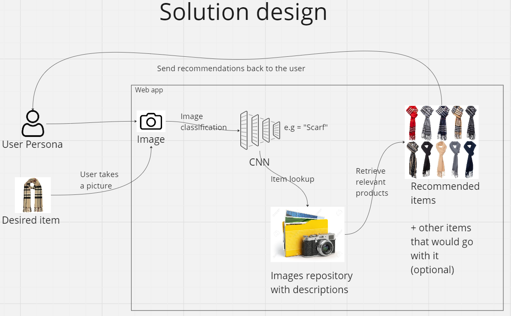

# oxford-ai-summit-hackathon-group-4
This is the official repository of Group 4's project for the Oxford AI Summit Hackathon held 24th and 25th May 2024

# Solution Design

Deadline : 7th of June 2024

# Links
## ChatGPT
- Load Dataset Load Model Train CNN Simple: https://chatgpt.com/share/18f954ae-68d0-43c6-94ce-ff620137b720
- Training CNN : https://chatgpt.com/share/fd803711-be10-41b7-ac77-e49d8ebbca30 

## Other
- Colab https://colab.research.google.com/github/konradbachusz/oxford-ai-summit-hackathon-group-4/blob/main/src/notebook.ipynb
- Miro board https://miro.com/welcomeonboard/RVluUVhCdWRwSUZXaHNXa0d0VkVYNGFIbGRFcFgxUWRSbjN5MDdGVFU3cEZ2THlhb2NrN09iS1dSckJrMHZwanwzMDc0NDU3MzQ3MDcyNDgxNjgxfDI=?share_link_id=700187827558

